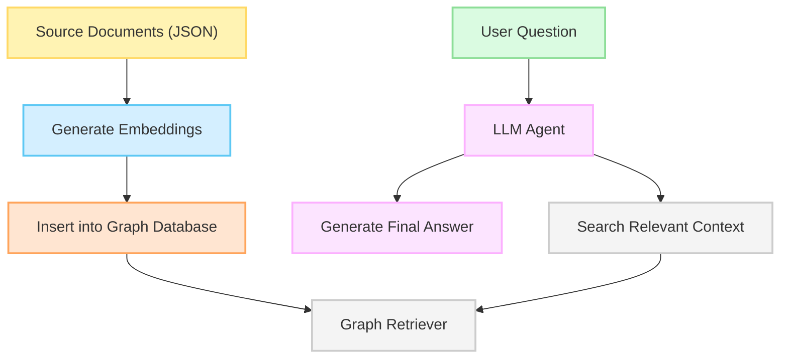

# CTF_Assistant

```
ctf-assistant/
├── README.md
├── requirements.txt
├── .env.example
├── main.py                  # Entry point (CLI)
├── config.py                # Paths, constants, env
├── logger.py                # Logging setup
├── rag/
│   ├── __init__.py
│   ├── loader.py            # JSON + document loading
│   ├── embeddings.py        # Embedding + graph creation
│   └── model.py             # HuggingFace pipeline loading
├── tools/
│   ├── __init__.py
│   ├── dirsearch_tool.py
│   ├── nmap_tool.py
│   ├── sqlmap_tool.py
│   ├── hashcat_tool.py
│   ├── cyberchef_tool.py
│   └── rag_tool.py
├── agent/
│   ├── __init__.py
│   ├── tool_router.py
│   ├── reasoning.py         # run_reasoning_loop
│   └── prompt_template.py
└── utils/
    ├── __init__.py
    ├── text_utils.py        # text formatting, extraction
    └── env_utils.py         # token and env parsing
```

### 💾 Dataset
Manually compiled based on real-world penetration testing data.

1️⃣ System analysis and reconnaissance (Initial Recon & Exploitation) – vulnerable ports, weak passwords.

2️⃣ Network & data forensics – packet capture analysis, cryptography challenges.

3️⃣ Low-level exploitation – buffer overflows, insecure code patterns.

4️⃣ Binary exploitation & reverse engineering – binary analysis, bypassing protection mechanisms.


