# CTF_Assistant

```
ctf-assistant/
├── README.md
├── requirements.txt
├── .env.example
├── main.py                  # Entry point (CLI)
├── config.py                # Paths, constants, env
├── logger.py                # Logging setup
├── rag/
│   ├── __init__.py
│   ├── loader.py            # JSON + document loading
│   ├── embeddings.py        # Embedding + graph creation
│   └── model.py             # HuggingFace pipeline loading
├── tools/
│   ├── __init__.py
│   ├── dirsearch_tool.py
│   ├── nmap_tool.py
│   ├── sqlmap_tool.py
│   ├── hashcat_tool.py
│   ├── cyberchef_tool.py
│   └── rag_tool.py
├── agent/
│   ├── __init__.py
│   ├── tool_router.py
│   ├── reasoning.py         # run_reasoning_loop
│   └── prompt_template.py
└── utils/
    ├── __init__.py
    ├── text_utils.py        # text formatting, extraction
    └── env_utils.py         # token and env parsing
```
## 🧩 Agent Architecture

```mermaid
flowchart LR
    Start([Start])
    Interact[User interacts with LLM]
    Process[LLM processes user input]
    Decision{Is a tool required?}
    Invoke[Invoke Tool for specific task]
    ToolResult[Tool generates result]
    Receive[LLM receives result from Tool]
    Respond[LLM provides response to User]
    End([End])

    Start --> Interact
    Interact --> Process
    Process --> Decision

    Decision -- Yes --> Invoke
    Invoke --> ToolResult --> Receive --> Respond --> End

    Decision -- No --> Respond

    %% Style definitions with black text
    classDef oval fill:#f3e8ff,stroke:#d8b4fe,stroke-width:2px,color:#000
    classDef block fill:#ffe4f0,stroke:#ffb3c6,stroke-width:2px,color:#000
    classDef decision fill:#e0f2ff,stroke:#90cdf4,stroke-width:2px,color:#000

    %% Apply styles
    class Start,End oval
    class Interact,Process,Invoke,ToolResult,Receive,Respond block
    class Decision decision


```



### 🔹 Core Components

#### 🧠 LLM Engine  
An open-source language model **OpenHermes-2.5-Mistral-7B** is used as the reasoning core, integrated via the HuggingFace Transformers and LangChain frameworks.

#### 🧾 Graph-Based Memory  
Retrieved documents and task-relevant embeddings are stored in a graph structure using **NetworkX**. This allows the agent to retrieve contextual information and reuse it in future steps.

#### 🛠️ Embedded Toolset  
The agent integrates with a set of real-world tools:
- **DirSearch** – for directory enumeration  
- **Nmap** – for port and service scanning  
- **SQLmap** – for automated SQL injection testing  
- **Hashcat** – for password hash cracking  
- **CyberChef** – for encoding/decoding tasks


#### 📊 Retrieval-Augmented Generation (RAG)  
JSON-based data (e.g., hash information) is indexed using text embeddings. A Retriever module selects relevant fragments to assist the LLM in answering questions.

#### 🔄 Reasoning Loop  
The agent performs step-by-step reasoning, logging all intermediate thoughts, tool actions, and observations before producing a final answer. Tool selection is guided by a rule-based dispatcher.


### 💾 Dataset
Manually compiled based on real-world penetration testing data.

1️⃣ System analysis and reconnaissance (Initial Recon & Exploitation) – vulnerable ports, weak passwords.

2️⃣ Network & data forensics – packet capture analysis, cryptography challenges.

3️⃣ Low-level exploitation – buffer overflows, insecure code patterns.

4️⃣ Binary exploitation & reverse engineering – binary analysis, bypassing protection mechanisms.

Example:

<pre>
  <div id="header" align="center"> 
  </div>
</pre>

### 🧪 Available Tools Table

| Tool       | Purpose                          | Example Input                  |
|------------|----------------------------------|--------------------------------|
| DirSearch  | Web directory enumeration        | `Scan https://example.com`     |
| Nmap       | Port scanning                    | `Scan 192.168.1.1 with nmap`   |
| SQLmap     | SQLi testing                     | `Check https://x.com?id=1`     |
| Hashcat    | MD5 hash cracking                | `Crack 5f4dcc3b5aa...`         |
| CyberChef  | Encode/Decode (Base64 etc.)      | `base64 encode hello`          |
| RAG        | Retrieve from internal JSON      | `What is hash 8f4d...?`        |
